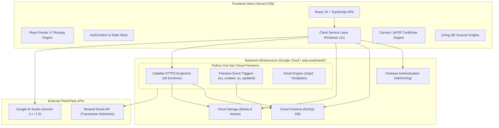
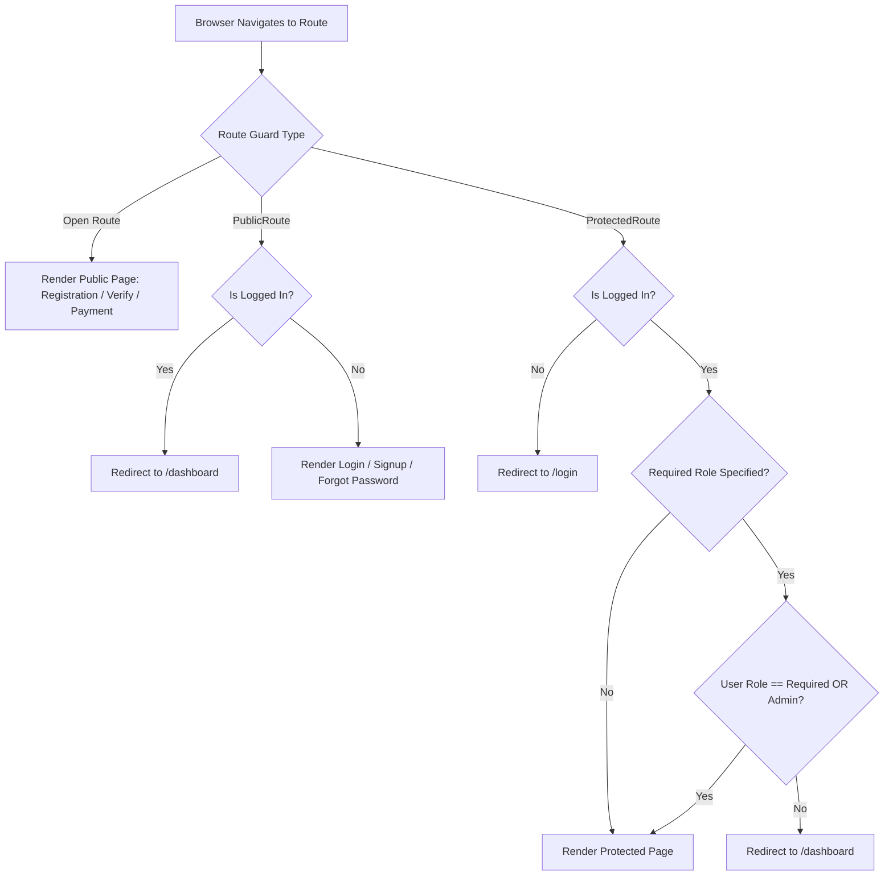
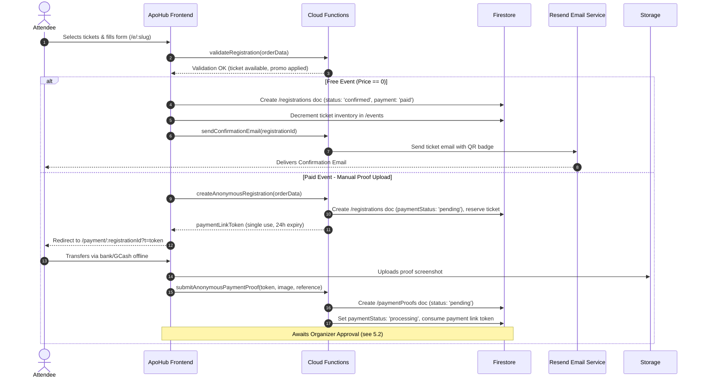
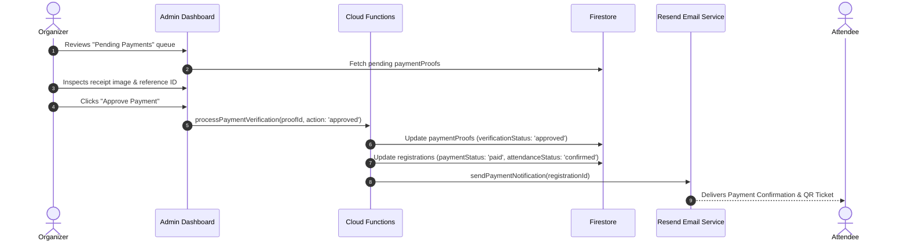
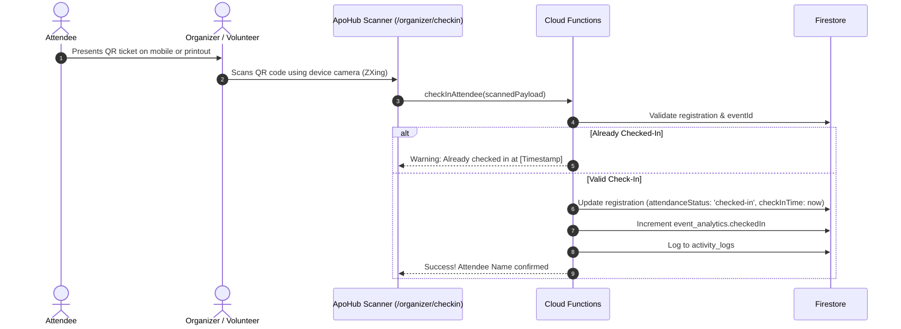
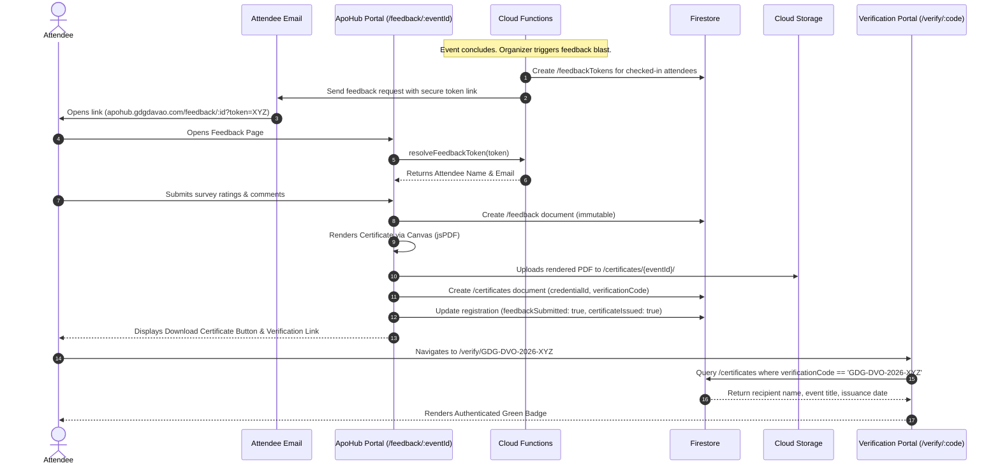
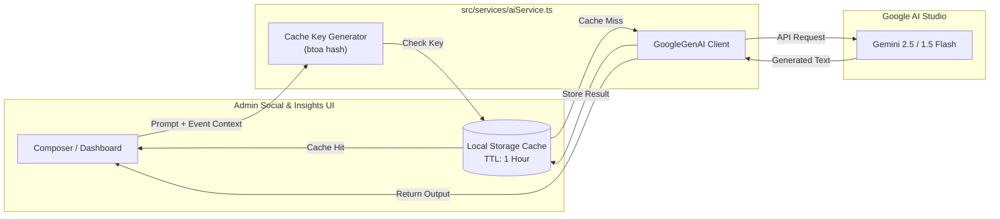

# APOHUB System Architecture Documentation

This document provides a comprehensive technical architecture overview of **APOHUB**, the event lifecycle management platform engineered for the **Google Developer Group (GDG) Davao** community.

---

## 1. Executive Summary & Architectural Overview

APOHUB is a modern, serverless cloud platform built to automate and centralize all stages of event operations:

* **Event Design & Publication**: Rich event configuration, multi-tier ticketing, custom registration forms, and speaker showcases.
* **Frictionless Registration**: Attendee registration without mandatory account creation.
* **Payments**: Manual verification — bank transfer / GCash receipt upload feeding an organizer review queue that releases the ticket. No third-party payment gateway is integrated.
* **On-Site Operations**: Camera-based QR code badge check-in with real-time analytics.
* **Automated Communications**: Context-aware transactional emails (confirmations, QR tickets, 24h/1h reminders, post-event feedback invitations) sent via Resend.
* **Post-Event Workflows**: Token-secured survey feedback, dynamic PDF certificate generation, and an open verification portal.
* **AI Assistance**: Gemini-powered social media captioning and event feedback sentiment analysis.



---

## 2. Technology Stack & Specifications

### 2.1 Frontend Stack
* **Framework**: [React 19.2](https://react.dev) + [TypeScript 5.7](https://www.typescriptlang.org)
* **Build Tool & Bundler**: [Vite 6.3](https://vitejs.dev) with Fast Refresh
* **Styling**: [Tailwind CSS 3.4](https://tailwindcss.com) with Google Material / Google Developer Group brand color palette
* **Routing**: [React Router 7.0](https://reactrouter.com) (Browser Router with declarative nested routes and layout wrappers)
* **Forms & Validation**: [React Hook Form 7.54](https://react-hook-form.com)
* **Icons & UI Primitives**: `@heroicons/react 2.2`, `lucide-react 0.46`, `@headlessui/react 2.2`
* **Client-Side QR Operations**: `@zxing/browser 0.1.5` (camera barcode scanning) + `qrcode 1.5.4` (SVG/Canvas generation)
* **Certificate Rendering**: `jspdf 2.5.2` + `html2canvas 1.4.1` + HTML5 Canvas API
* **AI Integration**: `@google/genai 1.15.0` (Google Gen AI SDK with custom local storage response caching)
* **Analytics**: `@vercel/analytics 1.5.0`

### 2.2 Backend & Cloud Services
* **Cloud Provider**: Google Cloud Platform / Firebase
* **Region**: `asia-southeast2` (Jakarta) — pinned globally across Firestore, Cloud Functions, and Cloud Storage for minimal latency in the Philippines
* **Database**: Cloud Firestore (Enterprise NoSQL database with client and server SDKs)
* **Object Storage**: Cloud Storage for Firebase (isolated buckets for event banners, templates, payment proofs, and certificates)
* **Serverless Compute**: Python 2nd Generation Cloud Functions (`firebase-functions 0.4.3`, `firebase_admin 7.1.0`, `Flask 3.1.2`, `functions-framework 3.9.2`) running on Google Cloud Run
* **Templating Engine**: `Jinja2 3.1.6` for responsive HTML email rendering

### 2.3 External Integrations
* **Payment Gateway**: None. Payment methods (bank transfer, GCash) are configured per event by the organizer and settled offline; release of a ticket is gated on manual proof review.
* **Email Service**: [Resend](https://resend.com) API (DKIM/SPF-verified domain sending with delivery webhook tracking)
* **AI Engine**: Google AI Studio (Gemini Flash / Pro models for automated social copy and survey sentiment distillation)

---

## 3. Frontend Architecture

### 3.1 Application File Structure
```
src/
├── App.tsx                      # Root route configuration & layout definitions
├── main.tsx                     # React DOM entry point
├── config/
│   └── firebase.ts              # Firebase Client SDK initialization & emulator detection
├── contexts/
│   └── AuthContext.tsx          # Authentication state, user profile snapshot, role provider
├── hooks/
│   ├── usePageTitle.ts          # Context-aware browser tab title updater
│   └── useDebounce.ts           # Debounce utility hook
├── types/
│   └── index.ts                 # Central TypeScript interfaces, enums, and data models
├── services/                    # Domain-driven service layer
│   ├── aiService.ts             # Gemini SDK wrapper with LRU localStorage cache
│   ├── analyticsService.ts      # Event analytics aggregation and metrics
│   ├── certificateService.ts    # Template composition, verification, and retrieval
│   ├── emailService.ts          # Email dispatch calls and activity log queries
│   ├── eventService.ts          # Event CRUD, slug resolution, and capacity tracking
│   ├── feedbackService.ts       # Survey validation, token exchange, and analytics
│   ├── formService.ts           # Dynamic form builder schema helpers
│   ├── notificationService.ts   # In-app organizer alerts
│   ├── paymentService.ts        # Manual proof upload & verification workflow
│   ├── registrationService.ts   # Atomic ticket checkout, reservation, and check-in
│   └── userService.ts           # User and role administration
├── pages/
│   ├── admin/                   # Administrative dashboards, user management, global analytics
│   ├── organizer/               # Event creator workspace, attendee roster, on-site scanner
│   ├── public/                  # Public event discovery, registration landing pages
│   ├── payment/                 # QR payment portals and transaction status screens
│   ├── feedback/                # Attendee feedback submission portal
│   ├── verification/            # Public certificate authenticity validator
│   └── auth/                    # Login, signup, password reset
└── components/                  # Reusable UI components
    ├── admin/                   # Admin layout, navigation sidebar, stats widgets
    ├── organizer/               # Event editor forms, attendee tables, check-in scanner
    ├── shared/                  # Error boundaries, modals, toasts, cards, buttons
    └── public/                  # Event hero, ticket selector, custom form fields
```

### 3.2 Routing & Access Control Hierarchy
The routing architecture (`src/App.tsx`) enforces strict boundary separation through route guards:

* **`PublicRoute`**: Accessible only by unauthenticated visitors. Redirects logged-in users to `/dashboard`.
* **`ProtectedRoute`**: Requires valid Firebase Authentication. Includes optional `requiredRole` checking (`'admin'` or `'organizer'`).
* **Open Routes**: Accessible to all (e.g. `/e/:slug` event registration, `/payment/:registrationId`, `/feedback/:eventId`, `/verify/:code`).



### 3.3 Dynamic Certificate Engine
Certificates are generated via client-side composition or Cloud Functions:
1. The background artwork (`certificateTemplates/{templateId}`) is retrieved from Cloud Storage.
2. An off-screen HTML5 Canvas draws the high-resolution background (1920x1080 or custom dimensions).
3. The engine dynamically maps:
   * Recipient full name with automatic font scaling to prevent overflow.
   * Event title, dates, and organizers' signatures.
   * A cryptographic QR code encoding the public verification URL (`/verify/{verificationCode}`).
4. The canvas exports a lossless PNG/PDF that is uploaded directly to `certificates/{eventId}/{filename}` in Cloud Storage and indexed in Firestore.

---

## 4. Serverless Backend Architecture (Python Cloud Functions)

The serverless backend in `functions/main.py` is implemented using **Python 3.11** and Google Cloud Functions 2nd Generation (built atop Google Cloud Run).

### 4.1 Function Endpoints Catalog

#### Event & Catalog Management
* `validate_event_data` / `validateEventData`: Validates event payload dates, ticketing limits, and required fields.
* `initialize_event`: Seeds default subcollections, forms, and analytics documents for a new event.
* `publish_event`: Atomic publishing toggle with sanity validation.
* `duplicate_event`: Deep-copies an existing event document and its ticket configurations.
* `deleteEventData`: Cascading deletion of event subcollections, registrations, proofs, and analytics.
* `get_event_statistics` / `getEventStatistics` / `getEventAnalytics`: Real-time calculation of ticket velocity, gross volume, and check-in rates.

#### Registration & Payments
* `validateRegistration`: Verifies ticket availability, promo code validity, and order limits.
* `registerForEvent`: Atomically records the registration, updates ticket sales counts, and dispatches confirmation emails.
* `processPaymentVerification`: Admin approval/rejection of manual payment proofs; transitions registration status to `'paid'` and sends ticket email.
* `bulkProcessPayments`: Batch approval for high-volume registration queues.

#### Attendance & Feedback
* `checkInAttendee`: Validates scanned QR payload, updates `attendanceStatus = 'checked-in'`, records `checkInTime`, and creates an activity log.
* `resolveFeedbackToken`: Resolves a one-time token into attendee details without exposing emails in the client URL.
* `submitFeedback`: Validates survey responses, stores feedback immutably, and triggers certificate generation.
* `sendFeedbackRequest`: Sends an individual post-event feedback invitation email.
* `resendEventFeedbackRequests`: Broadcasts feedback invitations to all attendees marked `'checked-in'` for an event.

#### Digital Credentials & Verification
* `generateCertificate`: Server-side fallback rendering and indexing of digital certificates.
* `sendCertificateNotification`: Dispatches the completed certificate notification with direct verification and download links.

#### Communications & Monitoring
* `sendConfirmationEmail`: Dispatches registration confirmation with embedded QR check-in ticket.
* `sendPaymentNotification`: Dispatches receipt or payment instructions.
* `sendEventReminder`: Scheduled/manual broadcast sent 24h and 1h prior to event start.
* `sendCheckInNotification`: Sends a welcome email upon badge check-in at the venue.
* `getResendEmailStatus` / `getAllResendEmails`: Connects to Resend API to retrieve live delivery, bounce, and open metrics.
* `health_check`: HTTP probe for uptime monitors.

### 4.2 Event-Driven Firestore Triggers
* `on_event_created` (`events/{eventId}`): Automatically provisions initial analytics documents and audit logs upon new event creation.
* `on_event_updated` (`events/{eventId}`): Watches for critical changes (e.g. status transition to `'cancelled'` or date changes) and triggers automated attendee broadcast alerts.

---

## 5. Core System Workflows

### 5.1 Attendee Registration & Payment Processing



---

### 5.2 Manual Payment Review Workflow



---

### 5.3 On-Site QR Check-In Workflow



---

### 5.4 Feedback Submission & Dynamic Certificate Verification



---

## 6. AI Subsystem Architecture

APOHUB integrates the **Google GenAI SDK** (`@google/genai`) to power intelligent organizer workflows.



### Key AI Features:
1. **Social Media Caption Composer**: Generates platform-tailored promotional copy for LinkedIn, Facebook, and X based on event speakers, topics, and date.
2. **Post-Event Sentiment Analysis**: Summarizes free-form attendee comments, aggregates top compliments, identifies logistics issues, and extracts requested future topics.
3. **Client-Side Deduplication Cache**: Implements an LRU-like 1-hour expiration cache in `localStorage` to prevent duplicate API requests and conserve quotas.

---

## 7. Deployment, Environments & Infrastructure

### 7.1 Multi-Environment Setup
| Parameter | Local Emulator Environment | Production Environment |
| :--- | :--- | :--- |
| **Frontend Host** | Vite Dev Server (`localhost:5173`) | Vercel Edge Network (`apohub.gdgdavao.com`) |
| **Auth** | Firebase Auth Emulator (`localhost:9099`) | Google Identity Toolkit |
| **Firestore** | Firestore Emulator (`localhost:8080`) | Cloud Firestore (`asia-southeast2`) |
| **Cloud Functions** | Functions Emulator (`localhost:5001`) | Cloud Functions v2 / Cloud Run (`asia-southeast2`) |
| **Storage** | Storage Emulator (`localhost:9199`) | Cloud Storage Bucket (`apohub-gdgdavao.appspot.com`) |

### 7.2 Build & Deployment Automation
The repository includes deployment scripts for all subsystems:

```bash
# Full local development stack (frontend + all emulators)
bun run dev:full

# Deploy Cloud Functions
bun run firebase:functions

# Deploy Firestore Security Rules & Indexes
bun run firebase:rules
bun run firebase:indexes

# Deploy Frontend to Vercel
vercel --prod
```
