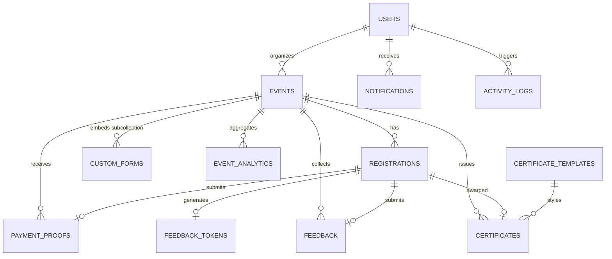

# APOHUB Database & Storage Schema Documentation

This document defines the complete data architecture for **APOHUB** (GDG Davao Event Management Platform). It details the Cloud Firestore collections, subcollections, document schemas, field types, relationships, composite indexes, and Cloud Storage bucket hierarchies.

---

## 1. Architectural Overview & Design Principles

APOHUB utilizes a NoSQL data architecture powered by **Google Cloud Firestore** in the `asia-southeast2` region (Jakarta). The schema is designed around the following architectural principles:

1. **Anonymous Attendee Model**: Event attendees do not require Firebase Authentication accounts. Attendee records, ticket allocations, and custom responses are encapsulated within the `registrations` collection and secured via strict field-level security rules and serverless Cloud Functions.
2. **Role-Based Administrative Access**: Event organizers and platform administrators have dedicated profiles in the `users` collection synchronized with Firebase Authentication UIDs.
3. **Denormalization for Query Efficiency**: Frequently accessed relational data (such as organizer names, event titles on certificates, and ticket snapshots) are denormalized into child documents to minimize read costs and latency.
4. **Auditability & Immutability**: Critical event logs (`activity_logs`) and survey feedback (`feedback`) are immutable once written.
5. **Token-Secured Anonymous Access**: Sensitive operations for non-authenticated attendees (e.g., feedback submission and payment access) use short-lived cryptographic tokens (`feedbackTokens`, `paymentLinkToken`) to prevent ID enumeration.

---

## 2. Entity-Relationship Diagram



---

## 3. Firestore Collections Specification

### 3.1 `users`
Stores administrative and organizer accounts. Attendee accounts are deliberately **not** stored here.

* **Document ID**: Firebase Auth UID (`request.auth.uid`)
* **Security**: Admin read/write; users can read/update their own profile.

| Field | Type | Required | Default | Description & Constraints |
| :--- | :--- | :---: | :---: | :--- |
| `uid` | `string` | Yes | - | Firebase Authentication user identifier. |
| `email` | `string` | Yes | - | Valid corporate/personal email (`.*@.*[.].*`). |
| `displayName` | `string` | Yes | - | Full name of the organizer or admin. |
| `role` | `string` | Yes | `'organizer'` | Role enum: `'admin'` \| `'organizer'`. |
| `photoURL` | `string` | No | - | Storage URL or Google profile avatar URL. |
| `phoneNumber` | `string` | No | - | Contact phone number. |
| `organization` | `string` | No | - | Organization/company affiliation. |
| `bio` | `string` | No | - | Professional biography or summary. |
| `skills` | `array<string>` | No | `[]` | List of technical skill tags. |
| `socialLinks` | `map` | No | `{}` | Social links (`github`, `linkedin`, `twitter`, `website`). |
| `createdAt` | `timestamp` | Yes | `serverTimestamp()` | Timestamp of account registration. |
| `updatedAt` | `timestamp` | Yes | `serverTimestamp()` | Timestamp of last profile modification. |

---

### 3.2 `events`
Primary entity representing GDG Davao events, workshops, meetups, and conferences.

* **Document ID**: Auto-generated Firestore ID (`eventId`)
* **Security**: Publicly readable. Modifiable by admins or assigned event organizers.

| Field | Type | Required | Default | Description & Constraints |
| :--- | :--- | :---: | :---: | :--- |
| `id` | `string` | Yes | Auto-ID | Document identifier matching Firestore key. |
| `slug` | `string` | Yes | - | URL-friendly unique slug (e.g. `io-extended-2026`). |
| `title` | `string` | Yes | - | Event title headline. |
| `description` | `string` | Yes | - | Rich text description / markdown content. |
| `shortDescription`| `string` | Yes | - | 1-2 sentence preview summary for cards and metadata. |
| `imageUrl` | `string` | No | - | Public banner image URL in Cloud Storage. |
| `bannerUrl` | `string` | No | - | High-resolution hero image URL. |
| `organizer` | `map` | Yes | - | Map: `{ uid: string, name: string, email: string }`. |
| `speakers` | `array<map>`| Yes | `[]` | Array of `Speaker` objects (see [Embedded Types](#4-embedded-data-structures)). |
| `startDate` | `timestamp` | Yes | - | Event start time (with timezone). |
| `endDate` | `timestamp` | Yes | - | Event conclusion time (`endDate >= startDate`). |
| `timezone` | `string` | Yes | `'Asia/Manila'`| IANA timezone string. |
| `venue` | `map` | Yes | - | Embedded `Venue` object (see [Embedded Types](#4-embedded-data-structures)). |
| `ticketTypes` | `array<map>`| Yes | `[]` | Array of `TicketType` objects. |
| `promoCodes` | `array<map>`| No | `[]` | Array of `PromoCode` discount configurations. |
| `paymentConfigs`| `array<map>`| No | `[]` | Payment configurations (GCash, Maya, Bank Details). |
| `tags` | `array<string>`| Yes| `[]` | Search and categorization tags (e.g. `['AI', 'Flutter']`). |
| `category` | `string` | Yes | `'meetup'` | Category enum: `'workshop'`, `'meetup'`, `'conference'`, `'hackathon'`, `'networking'`, `'webinar'`, `'study-jam'`, `'code-lab'`. |
| `status` | `string` | Yes | `'draft'` | Lifecycle status: `'draft'`, `'published'`, `'ongoing'`, `'completed'`, `'cancelled'`, `'postponed'`. |
| `registrationStatus` | `string` | Yes | `'open'` | Status: `'open'`, `'closed'`, `'walk-in-only'`. |
| `maxAttendees` | `number` | No | `null` | Global registration capacity limit. |
| `currentAttendees` | `number` | Yes | `0` | Live counter of confirmed/checked-in registrants. |
| `isPublished` | `boolean` | Yes | `false` | Quick index filter for public catalog visibility. |
| `registrationDeadline` | `timestamp` | No | - | Cutoff date for receiving registrations. |
| `requirements` | `array<string>`| No | `[]` | Prerequisites for attendees (e.g. "Bring laptop"). |
| `feedbackRequestsSentAt` | `timestamp` | No | - | Timestamp when automated feedback blast was triggered. |
| `feedbackRequestsSentCount` | `number` | No | `0` | Number of feedback email invitations dispatched. |
| `createdAt` | `timestamp` | Yes | `serverTimestamp()` | Record creation timestamp. |
| `updatedAt` | `timestamp` | Yes | `serverTimestamp()` | Last modification timestamp. |

#### Subcollections under `events/{eventId}`:
1. **`forms/{formId}`**: Custom dynamic form configurations for this event:
   * Fields: `id`, `name`, `type` (`'registration'` | `'feedback'`), `fields` (array of `FormField`), `isActive`, `updatedAt`.
2. **`config/{configId}`**: Extended configuration parameters (custom domain bindings, integrations, automated trigger thresholds).

---

### 3.3 `registrations`
Captures attendee registrations for specific events.

* **Document ID**: Auto-generated Firestore ID (`registrationId`)
* **Security**: Admins/organizers have full read/write access. Public users can create records and update limited fields (payment status and feedback completion).

| Field | Type | Required | Default | Description & Constraints |
| :--- | :--- | :---: | :---: | :--- |
| `id` | `string` | Yes | Auto-ID | Unique registration ID. |
| `eventId` | `string` | Yes | - | Foreign key referencing `events/{eventId}`. |
| `userId` | `string` | Yes | `'anonymous'` | ID of registrant (`'anonymous'` or walk-in uid). |
| `userDetails` | `map` | Yes | - | Registrant contact info: `{ name, email, phoneNumber, organization, dietaryRestrictions, tshirtSize, emergencyContact }`. |
| `ticketTypeId` | `string` | Yes | - | ID of selected ticket from `event.ticketTypes`. |
| `quantity` | `number` | Yes | `1` | Number of tickets reserved (default 1). |
| `originalAmount` | `number` | Yes | `0` | Base price in PHP before discounts. |
| `discountAmount` | `number` | Yes | `0` | Subtotal discount applied in PHP. |
| `totalAmount` | `number` | Yes | `0` | Net payable amount in PHP. |
| `currency` | `string` | Yes | `'PHP'` | Currency ISO code. |
| `promoCode` | `string` | No | - | Applied promo voucher code. |
| `promoCodeId` | `string` | No | - | ID reference to `PromoCode`. |
| `pricing` | `map` | Yes | - | Snapshot of pricing calculations and breakdown. |
| `paymentStatus` | `string` | Yes | `'pending'` | Enum: `'pending'`, `'processing'`, `'paid'`, `'failed'`, `'refunded'`, `'cancelled'`. |
| `paymentDetails` | `map` | No | - | Manual payment verification summary (method, reference, paid timestamp). |
| `paymentProof` | `map` | No | - | Manual payment verification summary snapshot. |
| `paymentLinkToken` | `string` | No | - | Cryptographic token for one-time payment portal. |
| `paymentLinkExpiresAt` | `timestamp`| No | - | Expiration timestamp for payment session. |
| `paymentLinkStatus` | `string` | No | `'active'` | Enum: `'active'`, `'consumed'`, `'expired'`. |
| `attendanceStatus` | `string` | Yes | `'registered'` | Enum: `'registered'`, `'confirmed'`, `'checked-in'`, `'no-show'`, `'cancelled'`. |
| `checkInTime` | `timestamp` | No | - | Timestamp when attendee was scanned on-site. |
| `feedbackSubmitted` | `boolean` | Yes | `false` | Flag indicating post-event feedback survey completion. |
| `feedbackRequestSent` | `boolean` | Yes | `false` | Flag indicating feedback invitation email sent. |
| `feedbackRequestSentAt` | `timestamp`| No | - | Timestamp feedback email was sent. |
| `feedbackId` | `string` | No | - | Reference to `feedback/{feedbackId}` document. |
| `certificateIssued` | `boolean` | Yes | `false` | True when digital certificate is generated. |
| `certificateId` | `string` | No | - | Reference to `certificates/{certificateId}`. |
| `certificateVerificationCode` | `string` | No | - | Stable credential ID (e.g. `GDG-DVO-EVT101-ATT56`). |
| `certificateEmailSent` | `boolean` | Yes | `false` | Flag indicating certificate link email dispatch. |
| `qrCode` | `string` | Yes | - | Base64 or string payload encoded into check-in badge. |
| `registrationType` | `string` | Yes | `'online'` | Enum: `'online'` \| `'walk-in'`. |
| `registeredBy` | `string` | No | - | UID of admin/organizer who registered walk-in. |
| `customResponses` | `map` | No | `{}` | Dynamic responses keyed by `FormField.id`. |
| `registrationDate` | `timestamp` | Yes | `serverTimestamp()` | Registration submission timestamp. |
| `updatedAt` | `timestamp` | Yes | `serverTimestamp()` | Last update timestamp. |

---

### 3.4 `certificates`
Publicly verifiable digital credentials issued to attendees who attended and submitted feedback.

* **Document ID**: Auto-generated Firestore ID or unique credential hash (`certificateId`)
* **Security**: Publicly readable by anyone. Anonymous creation permitted via validation rules post-feedback.

| Field | Type | Required | Default | Description & Constraints |
| :--- | :--- | :---: | :---: | :--- |
| `id` | `string` | Yes | Auto-ID | Document ID. |
| `credentialId` | `string` | Yes | - | Public alphanumeric ID (e.g. `GDG-DVO-2026-X89B2`). |
| `eventId` | `string` | Yes | - | Reference to `events/{eventId}`. |
| `registrationId` | `string` | Yes | - | Reference to `registrations/{registrationId}`. |
| `recipientName` | `string` | Yes | - | Full legal name displayed on the certificate. |
| `eventTitle` | `string` | Yes | - | Cached event title at time of issuance. |
| `eventDate` | `string` | Yes | - | Human-readable event date string. |
| `completionDate` | `timestamp` | Yes | `serverTimestamp()` | Date requirement satisfied. |
| `certificateUrl` | `string` | Yes | - | Cloud Storage download URL for rendered PDF/PNG. |
| `verificationUrl` | `string` | Yes | - | Public verification URL (`events.gdgdavao.com/verify/{code}`). |
| `isVerified` | `boolean` | Yes | `true` | Credential validity status. |
| `templateId` | `string` | Yes | - | Reference to `certificateTemplates/{templateId}`. |
| `metadata` | `map` | No | `{}` | Key-value metadata: `{ eventDuration, skills, topics }`. |
| `downloadCount` | `number` | Yes | `0` | Number of times attendee downloaded the file. |
| `verificationCount` | `number` | Yes | `0` | Public view / verification count. |
| `issuedAt` | `timestamp` | Yes | `serverTimestamp()` | Issuance timestamp. |

---

### 3.5 `certificateTemplates`
Visual layout and typography specifications for rendering dynamic certificates.

* **Document ID**: Auto-generated ID (`templateId`)
* **Security**: Publicly readable (so clients can render certificates dynamically); writable only by Admin or Organizer.

| Field | Type | Required | Default | Description & Constraints |
| :--- | :--- | :---: | :---: | :--- |
| `id` | `string` | Yes | Auto-ID | Template ID. |
| `name` | `string` | Yes | - | Human-readable title (e.g. "DevFest 2026 Attendee"). |
| `description` | `string` | No | - | Template notes and context. |
| `eventId` | `string` | No | - | Optional link to specific event. |
| `templateImageUrl`| `string` | Yes | - | Base background PNG storage URL. |
| `dimensions` | `map` | Yes | `{ width: 1920, height: 1080 }` | Canvas pixel dimensions. |
| `templateMode` | `string` | Yes | `'enhanced'` | Enum: `'legacy'` \| `'enhanced'`. |
| `textPositions` | `map` | No | - | Legacy fixed positioning map (recipientName, qrCode, etc.). |
| `elements` | `array<map>`| No | `[]` | Dynamic elements array (Text, QR codes, coordinates, fonts). |
| `isActive` | `boolean` | Yes | `true` | Whether template is currently selectable. |
| `usageCount` | `number` | Yes | `0` | Counter of certificates generated using this template. |
| `createdBy` | `string` | Yes | - | UID of creating organizer/admin. |
| `createdAt` | `timestamp` | Yes | `serverTimestamp()` | Creation timestamp. |
| `updatedAt` | `timestamp` | Yes | `serverTimestamp()` | Last updated timestamp. |

---

### 3.6 `feedbackTokens`
One-time cryptographic tokens generated when feedback requests are dispatched.

* **Document ID**: High-entropy token string (`tokenId`)
* **Security**: **Strictly private**. Client access denied (`allow read, write: if false`). Accessible only through Cloud Functions Admin SDK (`resolveFeedbackToken`).

| Field | Type | Required | Description |
| :--- | :--- | :---: | :--- |
| `token` | `string` | Yes | Cryptographic token string. |
| `eventId` | `string` | Yes | Target event ID. |
| `registrationId` | `string` | Yes | Target registration ID. |
| `userEmail` | `string` | Yes | Recipient email address. |
| `userName` | `string` | Yes | Recipient display name. |
| `expiresAt` | `timestamp` | Yes | Token expiration date (typically 14-30 days post-event). |
| `createdAt` | `timestamp` | Yes | Creation timestamp. |
| `usedAt` | `timestamp` | No | Timestamp of survey submission. |

---

### 3.7 `feedback`
Attendee post-event evaluations and survey responses.

* **Document ID**: Auto-generated ID (`feedbackId`)
* **Security**: Authenticated admin/organizers can read. Anonymous attendees can create if matching valid email format. **Updates are strictly disallowed** (immutable).

| Field | Type | Required | Default | Description & Constraints |
| :--- | :--- | :---: | :---: | :--- |
| `id` | `string` | Yes | Auto-ID | Feedback document ID. |
| `eventId` | `string` | Yes | - | Reference to `events/{eventId}`. |
| `registrationId`| `string` | Yes | - | Reference to `registrations/{registrationId}`. |
| `userId` | `string` | No | `'anonymous'` | Registrant UID if available. |
| `userEmail` | `string` | Yes | - | Valid email string. |
| `userName` | `string` | No | - | Recipient name. |
| `overallRating` | `number` | Yes | - | Numerical rating between 1 and 5. |
| `contentRating` | `number` | No | - | Rating for event technical content (1-5). |
| `organizationRating`| `number` | No | - | Rating for event logistics (1-5). |
| `venueRating` | `number` | No | - | Rating for venue/platform (1-5). |
| `speakerRatings`| `array<map>`| No | `[]` | Array: `[{ speakerId, rating, comments }]`. |
| `comments` | `string` | No | `""` | Free-form feedback text. |
| `suggestions` | `string` | No | `""` | Recommendations for future meetups. |
| `wouldRecommend`| `boolean` | Yes | `true` | NPS recommendation indicator. |
| `futureTopics` | `array<string>`| No| `[]` | Requested topics for future GDG sessions. |
| `responses` | `map` | No | `{}` | Key-value responses to custom event feedback questions. |
| `submittedAt` | `timestamp` | Yes | `serverTimestamp()` | Submission timestamp. |

---

### 3.8 `paymentProofs`
Proof-of-payment receipts uploaded by attendees choosing manual payment channels (GCash, Maya, Bank Deposit).

* **Document ID**: Auto-generated ID (`proofId`)
* **Security**: Public read permitted for payment verification check workflows; anonymous create allowed with initial status `'pending'`. Modifications restricted to authenticated admins/organizers.

| Field | Type | Required | Default | Description & Constraints |
| :--- | :--- | :---: | :---: | :--- |
| `id` | `string` | Yes | Auto-ID | Document ID. |
| `registrationId`| `string` | Yes | - | Associated registration ID. |
| `eventId` | `string` | Yes | - | Associated event ID. |
| `email` | `string` | Yes | - | Attendee email address. |
| `proofImageUrl` | `string` | Yes | - | Cloud Storage path / public URL of payment receipt screenshot. |
| `transactionId` | `string` | No | - | Reference / transaction ID entered by attendee. |
| `verificationStatus` | `string` | Yes | `'pending'` | Enum: `'pending'` \| `'approved'` \| `'rejected'`. |
| `submittedAt` | `timestamp` | Yes | `serverTimestamp()` | Upload timestamp. |
| `verifiedAt` | `timestamp` | No | - | Timestamp when organizer approved/rejected proof. |
| `verifiedBy` | `string` | No | - | UID of admin/organizer who reviewed proof. |
| `notes` | `string` | No | - | Rejection rationale or audit comment. |

---

### 3.9 `activity_logs`
Immutable audit log recording system operations, emails sent, payments processed, and check-in scans.

* **Document ID**: Auto-generated ID (`logId`)
* **Security**: Authenticated read only. Authenticated create. **Updates disallowed** (tamper-proof).

| Field | Type | Required | Description |
| :--- | :--- | :---: | :--- |
| `id` | `string` | Yes | Log ID. |
| `type` | `string` | Yes | Event type: `'email_confirmation_sent'`, `'payment_notification_sent'`, `'event_reminder_sent'`, `'feedback_request_sent'`, `'checkin_notification_sent'`, `'admin_action'`. |
| `userId` | `string` | No | Actor UID (if authenticated action). |
| `eventId` | `string` | No | Related event ID. |
| `registrationId`| `string` | No | Related registration ID. |
| `userEmail` | `string` | No | Target recipient email. |
| `userName` | `string` | No | Target recipient name. |
| `emailId` | `string` | No | Resend API message ID for delivery tracking. |
| `success` | `boolean` | Yes | Operation outcome flag. |
| `status` | `string` | No | Status description / provider code. |
| `details` | `map` | No | Additional diagnostic metadata. |
| `timestamp` | `timestamp` | Yes | Creation timestamp (`serverTimestamp()`). |

---

### 3.10 `event_analytics`
Pre-aggregated rollups and metrics calculated per event to power real-time dashboards without querying raw collections.

* **Document ID**: Matches `eventId` (`analyticsId`)
* **Security**: Read/write restricted to authenticated admins/organizers.

| Field | Type | Description |
| :--- | :--- | :--- |
| `eventId` | `string` | Target event reference. |
| `registrationStats`| `map` | `{ totalRegistrations, paidRegistrations, freeRegistrations, revenue, refunds }`. |
| `attendanceStats` | `map` | `{ checkedIn, noShows, attendanceRate }`. |
| `feedbackStats` | `map` | `{ totalResponses, averageRating, responseRate }`. |
| `certificateStats` | `map` | `{ issued, verified }`. |
| `demographics` | `map` | Aggregates: `{ organizations: {}, skills: {}, locations: {} }`. |
| `timeline` | `map` | Timeseries buckets: `{ registrationsByDate: {}, checkInsByHour: {} }`. |
| `lastUpdated` | `timestamp` | Timestamp of last aggregation calculation. |

---

### 3.11 `notifications`
In-app alerts and notifications displayed in organizer and administrator notification panels.

* **Document ID**: Auto-generated ID (`notificationId`)
* **Security**: Only the user whose UID matches `userId` can read, update, or delete. System / anonymous triggers can create notifications.

| Field | Type | Required | Description |
| :--- | :--- | :---: | :--- |
| `id` | `string` | Yes | Notification ID. |
| `userId` | `string` | Yes | Target admin/organizer UID. |
| `type` | `string` | Yes | Notification type (e.g. `'admin_pending_attendee'`, `'admin_payment_verified'`). |
| `title` | `string` | Yes | Short headline. |
| `message` | `string` | Yes | Detailed body message. |
| `data` | `map` | No | Contextual metadata payload (e.g. `{ eventId, registrationId }`). |
| `isRead` | `boolean` | Yes | Read flag (`false` upon creation). |
| `isEmailSent` | `boolean` | Yes | Whether mirrored notification email was dispatched. |
| `createdAt` | `timestamp` | Yes | Timestamp. |

---

### 3.12 `system`
Global system configuration documents, feature flags, and platform-wide constants.

* **Document ID**: Config category name (e.g. `general`, `integrations`, `maintenance`)
* **Security**: Read/write restricted to authenticated admins.

---

## 4. Embedded Data Structures

### `Speaker`
```typescript
interface Speaker {
  id: string;
  name: string;
  title: string;
  company?: string;
  bio: string;
  photoUrl?: string;
  socialLinks?: {
    github?: string;
    linkedin?: string;
    twitter?: string;
    website?: string;
  };
  topics?: string[];
}
```

### `Venue`
```typescript
interface Venue {
  type: 'online' | 'offline' | 'hybrid';
  name?: string;
  address?: string;
  city: string;
  coordinates?: {
    lat: number;
    lng: number;
  };
  onlineDetails?: {
    platform: string;
    meetingUrl?: string;
    meetingId?: string;
    instructions?: string;
  };
  capacity?: number;
  amenities?: string[];
}
```

### `TicketType`
```typescript
interface TicketType {
  id: string;
  name: string;
  description?: string;
  price: number;
  currency: string;
  maxQuantity?: number;
  currentSold: number;
  isActive: boolean;
  benefits?: string[];
  sortOrder: number;
  discountPercentage?: number;
  validFrom?: Timestamp;
  validUntil?: Timestamp;
}
```

### `PromoCode`
```typescript
interface PromoCode {
  id: string;
  code: string;
  name: string;
  description?: string;
  discountType: 'percentage' | 'fixed';
  discountValue: number;
  currency?: string;
  maxUses?: number;
  currentUses: number;
  isActive: boolean;
  validFrom: Timestamp;
  validUntil: Timestamp;
  applicableTicketTypes?: string[];
  minOrderAmount?: number;
  maxDiscountAmount?: number;
  createdBy: string;
  createdAt: Timestamp;
  updatedAt: Timestamp;
}
```

---

## 5. Composite Indexes Specification

The following composite indexes are deployed via [firestore.indexes.json](file:///Users/gab/Developer/apohub/firestore.indexes.json) to support complex multi-field filtering and sorting:

### Collection Group: `events`
1. `(isPublished ASC, startDate ASC)` — Powers public upcoming event discovery.
2. `(isPublished ASC, status ASC, startDate ASC)` — Filters public active events by status.
3. `(organizer.uid ASC, createdAt DESC)` — Powers organizer dashboard event list.
4. `(category ASC, isPublished ASC, startDate ASC)` — Category filtering on public explore page.
5. `(venue.city ASC, isPublished ASC, startDate ASC)` — City/location filtering.
6. `(venue.type ASC, isPublished ASC, startDate ASC)` — Filter by Online vs Offline.
* **Array-Contains overrides**:
  * `tags` (Array-contains query scope: COLLECTION)
  * `speakers` (Array-contains query scope: COLLECTION)

### Collection Group: `registrations`
1. `(eventId ASC, registrationDate DESC)` — Organizer attendee roster sorted chronologically.
2. `(eventId ASC, paymentStatus ASC, registrationDate DESC)` — Filter registrations by payment state.
3. `(eventId ASC, attendanceStatus ASC)` — Attendance dashboard & check-in filtering.

### Collection Group: `paymentProofs`
1. `(verificationStatus ASC, submittedAt DESC)` — Organizer pending payment verification queue.
2. `(eventId ASC, submittedAt DESC)` — Event-specific payment proofs.
3. `(registrationId ASC, submittedAt DESC)` — Lookup proof by registration.

### Collection Group: `feedback`
1. `(eventId ASC, submittedAt DESC)` — Event feedback timeline.

### Collection Group: `activity_logs`
1. `(type ASC, timestamp DESC)` — Filter logs by event/action type.
2. `(userId ASC, timestamp DESC)` — Filter logs by triggering user.

### Collection Group: `notifications`
1. `(userId ASC, createdAt DESC)` — User notification feed.
2. `(userId ASC, type ASC, createdAt DESC)` — Categorized user notifications.

---

## 6. Cloud Storage Directory Hierarchy

Firebase Cloud Storage (`b/{bucket}/o`) stores all static media, payment receipts, and generated PDF assets.

```
storage-bucket/
├── events/
│   └── {eventId}/
│       ├── images/
│       │   └── {imageId}                # Event banners, posters, thumbnails (< 5MB)
│       └── documents/
│           └── {docId}                  # Schedules, slide decks, PDFs (< 10MB)
│
├── payment-proofs/
│   └── {registrationId}/
│       └── proof-{timestamp}.{ext}      # Uploaded GCash/Maya screenshots (< 5MB)
│
├── certificates/
│   └── {eventId}/
│       └── {filename}.(pdf|png)         # Dynamic attendee certificates (< 2MB)
│
├── certificate-templates/
│   └── {templateId}/
│       └── {fileId}.png                 # Certificate background artwork (< 5MB)
│
├── speaker-photos/
│   └── {eventId}/
│       └── {speakerId}/
│           └── {photoId}                # Speaker headshots (< 5MB)
│
├── profile-pictures/
│   └── {userId}/
│       └── {imageId}                    # Organizer/Admin profile avatars (< 5MB)
│
└── system/
    └── {allPaths}                       # Global branding assets, official GDG logos
```
